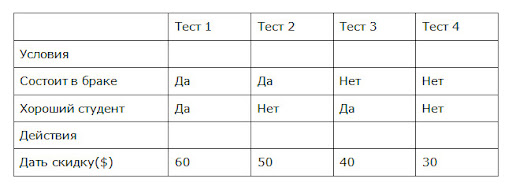

# **Тестовая документация**

## **Что такое "Требования?**
*Требования* — это спецификация (описание) того, что должно быть реализовано.
Требования описывают то, что необходимо реализовать, без детализации технической стороны решения. Что, а не как.

## **Какие бывают требования к требованиям?**
* *Корректность* -  Набор требований к программному обеспечению является корректным тогда и только тогда, когда каждое требование, сформулированное в нем, представляет нечто, требуемое от создаваемой системы.
* *Недвусмысленность* - Требование является недвусмысленным тогда и только тогда, когда его можно однозначно интерпретировать. Хотя главным свойством любого требования по праву считается корректность, однозначность зачастую представляет собой более сложную проблему. Если формулировка требований может по-разному интерпретироваться разработчиками, пользователями и другими участниками проекта, вполне может оказаться, что построенная система будет полностью отличаться от того, что представлял себе пользователь. 
* *Полнота набора требований* - Набор требований является полным тогда и только тогда, когда он описывает все важные требования, интересующие пользователя, в том числе требования, связанные с функциональными возможностями, производительностью, ограничениями проектирования, атрибутами или внешними интерфейсами. Полный набор требований должен также задавать требуемый ответ программы на всевозможные классы ввода — как правильные, так и неправильные — во всевозможных ситуациях.
* *Непротиворечивость набора требований* - Множество требований является внутренне непротиворечивым, когда ни одно его подмножество, состоящее из отдельных требований, не противоречит другим подмножествам. Конфликты могут иметь различную форму и проявляться на различных уровнях детализации; если набор требований был написан достаточно формально и поддерживается соответствующими автоматическими средствами, конфликт иногда удается обнаружить посредством механического анализа. Но, скорее всего, разработчикам вместе с другими участниками проекта придется провести проверку множества требований вручную, чтобы удалить все потенциальные конфликты.
* *Проверяемость (тестопригодность)* - Требование в целом является проверяемым, когда каждое из составляющих его элементарных требований является проверяемы, т.е. когда можно протестировать каждое из них и выяснить, действительно ли они выполняются.
* *Трассируемость* - Требование в целом является трассируемым, когда ясно происхождение каждого из составляющих его элементарных требований и существует механизм, который делает возможным обращение к этому требованию при дальнейших действиях по разработке. На практике это обычно означает, что каждое требование имеет уникальный номер или идентификатор. Возможность трассировки имеет огромное значение. Разработчики могут использовать ее как для достижения лучшего понимания проекта, так и для обеспечения более высокой степени уверенности, что все требования выполняются данной реализацией. 
* *Понимаемость*

## **Требования к ПО бывают:**
*Прямыми* - (Формализованными в технической документации, спецификациях, User Story)
*Косвенными* - (Проистекающими из прямых, либо являющиеся негласным стандартом для данной продукции или основывающиеся на опыте и здравом смысле использования продукта или продуктов подобных ему)

## **Зачем нужна тестовая документация?**
Тестовая документация — набор документов, создаваемых перед началом процесса тестирования и непосредственно в процессе. Эти документы описывают покрытие тестами и процесс выполнения тестов, в них указываются необходимые для тестирования вещи, приводится основная терминология и т. д. В тестовой документации любой член команды может найти полную информацию обо всех действиях, связанных с тестированием (и об уже выполненных, и о запланированных). Тестовая документация определяет, что для нас важно и почему, какие действия мы должны выполнить и сколько времени у нас есть. Наконец, в документации обозначено, чего должна достичь команда и что сигнализирует об окончании процесса.
https://habr.com/ru/company/otus/blog/588923/

## **Какие виды тестовой документации Вы знаете?**
План тестирования (test plan)
Чеклист (checklist)
Тестовый сценарий (Test Case)
Баг-репорт (Bug Report)
Отчёт о тестировании (Test Report)
Инструкция (Manual)

## **Что такое Тест-план? Какие элементы у него есть?**
*План тестирования (Test Plan)* — документ, описывающий весь объем работ по тестированию, начиная с описания объекта, стратегии, расписания, критериев начала и окончания тестирования, до необходимого в процессе работы оборудования, специальных знаний, а также оценки рисков с вариантами их разрешения.

В стандарте IEEE 829 перечислены пункты, из которых может/должен состоять тест-план:
* Идентификатор тест плана (Test plan identifier);
* Введение (Introduction);
* Объект тестирования (Test items);
* Функции, которые будут протестированы (Features to be tested;)
* Функции, которые не будут протестированы (Features not to be tested);
* Тестовые подходы (Approach);
* Критерии прохождения тестирования (Item pass/fail criteria);
* Критерии приостановления и возобновления тестирования (Suspension criteria and resumption requirements);
* Результаты тестирования (Test deliverables);
* Задачи тестирования (Testing tasks);
* Ресурсы системы (Environmental needs);
* Обязанности (Responsibilities);
* Роли и ответственность (Staffing and training needs);
* Расписание (Schedule);
* Оценка рисков (Risks and contingencies);
* Согласования (Approvals).

## **Какую обязательную информацию должен содержать тест-план? Как правильно его использовать, поддерживать и нужен ли он вообще для большинства проектов?** 
*Должен отвечать на вопросы:*

Что надо тестировать?
Что будете тестировать?
Как будете тестировать?
Когда будете тестировать?
Критерии начала тестирования.
Критерии окончания тестирования.
Составляется до начала этапа тестирования. Для проектов использующих agile подходы тест-план может быстро устаревать, т.к. условия и требования могут регулярно менятся. Соответственно потребуются трудозатраты по его обновлению.

## **Что такое Чек-лист (check list)?**
*Чек-лист (check list)* — это документ, описывающий что должно быть протестировано. При этом чек-лист может быть абсолютно разного уровня детализации. На сколько детальным будет чек-лист зависит от требований к отчетности, уровня знания продукта сотрудниками и сложности продукта.
Как правило, чек-лист содержит только действия (шаги), без ожидаемого результата. Чек-лист менее формализован чем тестовый сценарий. Его уместно использовать тогда, когда тестовые сценарии будут избыточны. Также чек-лист ассоциируются с гибкими подходами в тестировании.

## **Что такое Тестовый кейс/сценарий (Test Case)?**
*Тестовый кейс/сценарий (Test Case)* — артефакт, описывающий совокупность шагов, конкретных условий и параметров, необходимых для проверки реализации тестируемой функции или её части.
Должен иметь 3 части:

*PreConditions* - список действий, которые приводят систему к состоянию пригодному для проведения основной проверки. Либо список условий, выполнение которых говорит о том, что система находится в пригодном для проведения основного теста состояния.
*Test Case Description* - список действий, переводящих систему из одного состояния в другое, для получения результата, на основании которого можно сделать вывод о удовлетворении реализации, поставленным требованиям
*PostConditions* - список действий, переводящих систему в первоначальное состояние (состояние до проведения теста — initial state)
Тест кейсы разделяют на позитивные и негативные:

Позитивный тест кейс использует только корректные данные и проверяет, что приложение правильно выполнило вызываемую функцию.
Негативный тест кейс оперирует как корректными так и некорректными данными (минимум 1 некорректный параметр) и ставит целью проверку исключительных ситуаций (срабатывание валидаторов), а также проверяет, что вызываемая приложением функция не выполняется при срабатывании валидатора.

## **Что такое Дефект (он же баг)?**
*Дефект (он же баг)* — это несоответствие фактического результата выполнения программы ожидаемому результату. Дефекты обнаруживаются на этапе тестирования программного обеспечения (ПО), когда тестировщик проводит сравнение полученных результатов работы программы (компонента или дизайна) с ожидаемым результатом, описанным в спецификации требований.

## **Что значит Error?**
*Error* — ошибка пользователя, то есть он пытается использовать программу иным способом.
Пример — вводит буквы в поля, где требуется вводить цифры (возраст, количество товара и т.п.).
В качественной программе предусмотрены такие ситуации и выдаются сообщение об ошибке (error message), с красным крестиком которые.

## **Что значит Bug (defect)?**
*Bug (defect)* — ошибка программиста (или дизайнера или ещё кого, кто принимает участие в разработке), то есть когда в программе, что-то идёт не так как планировалось и программа выходит из-под контроля. Например, когда никак не контроллируется ввод пользователя, в результате неверные данные вызывают краши или иные «радости» в работе программы. Либо внутри программа построена так, что изначально не соответствует тому, что от неё ожидается.

## **Опишите жизненный цикл бага**

## **Что значит Failure?**
*Failure* — сбой (причём не обязательно аппаратный) в работе компонента, всей программы или системы. То есть, существуют такие дефекты, которые приводят к сбоям (A defect caused the failure) и существуют такие, которые не приводят. UI-дефекты например. Но аппаратный сбой, никак не связанный с software, тоже является failure.

## **Что такое Баг Репорт (Bug Report)?**
*Баг Репорт (Bug Report)* — это документ, описывающий ситуацию или последовательность действий приведшую к некорректной работе объекта тестирования, с указанием причин и ожидаемого результата.

## **Какие атрибуты Баг Репорта Вы знаете?**
Атрибуты:

*Короткое описание (Summary/Title)* - выжимка информации явно указывающая на причину и тип проблемы.
*Проект (Project)* Название тестируемого проекта
*Компонент приложения (Component)* Название части или функции тестируемого продукта
*Номер версии (Version)* - версия на которой была найдена ошибка
*Серьезность (Severity)* Наиболее распространена пятиуровневая система градации серьезности дефекта:
* S1 Блокирующий (Blocker)
* S2 Критический (Critical)
* S3 Значительный (Major)
* S4 Незначительный (Minor)
* S5 Тривиальный (Trivial)
*Приоритет (Priority)* Приоритет дефекта:
* P1 Высокий (High)
* P2 Средний (Medium)
* P3 Низкий (Low)
*Статус (Status)* Статус бага. Зависит от используемой процедуры и жизненного цикла бага (bug workflow and life cycle)
*Автор (Author)* Создатель баг репорта
*Назначен на (Assigned To)* Имя сотрудника, назначенного на решение проблемы
*Окружение (Environment)* - ОС / Браузер + версия и т.п. Информация об окружении, на котором был найден баг.
*Шаги воспроизведения (Steps to Reproduce)* - действия, по которым можно легко воспроизвести ситуацию, приведшую к ошибке.
*Фактический Результат (Actual Result)* - результат, полученный после прохождения шагов к воспроизведению
*Ожидаемый результат (Expected Result)* - ожидаемый правильный результат
*Прикрепленный файл (Attachment)* Файл с логами, скриншот или любой другой документ, который может помочь прояснить причину ошибки или указать на способ решения проблемы

## **Какая разница между приоритетом и серьезностью?**
*Серьезность (Severity)* - атрибут, характеризующий влияние дефекта на работоспособность приложения.

*Приоритет (Priority)* - атрибут, указывающий на очередность выполнения задачи или устранения дефекта. Больше инструмент менеджера по планированию работ. Чем выше приоритет, тем быстрее нужно исправить дефект

Обычно Severity выставляется тестировщиком, а Priority — менеджером, тимлидом или заказчиком.

## **Приведите примеры серьезного, но не приоритетного бага.**
На Андроиде 4.4 приложение при первом запуске падает. В последующие запуски работает нормально. Т.к. пользователей с этой версией ОС у нас около 0,5%, то приоретет можно поставить низкий или вообще проигнорировать.

## **Какие градации Серьезности дефекта (Severity) можете назвать?**
*S1 Блокирующая (Blocker)*
Блокирующая ошибка, приводящая приложение в нерабочее состояние, в результате которого дальнейшая работа с тестируемой системой или ее ключевыми функциями становится невозможна. Решение проблемы необходимо для дальнейшего функционирования системы.

*S2 Критическая (Critical)*
Критическая ошибка, неправильно работающая ключевая бизнес логика, дыра в системе безопасности, проблема, приведшая к временному падению сервера или приводящая в нерабочее состояние некоторую часть системы, без возможности решения проблемы, используя другие входные точки. Решение проблемы необходимо для дальнейшей работы с ключевыми функциями тестируемой системой.

*S3 Значительная (Major)*
Значительная ошибка, часть основной бизнес логики работает некорректно. Ошибка не критична или есть возможность для работы с тестируемой функцией, используя другие входные точки.

*S4 Незначительная (Minor)*
Незначительная ошибка, не нарушающая бизнес логику тестируемой части приложения, очевидная проблема пользовательского интерфейса.

*S5 Тривиальная (Trivial)*
Тривиальная ошибка, не касающаяся бизнес логики приложения, плохо воспроизводимая проблема, малозаметная посредствам пользовательского интерфейса, проблема сторонних библиотек или сервисов, проблема, не оказывающая никакого влияния на общее качество продукта.

## **Какие градации Приоритета дефекта (Priority) моеже назвать?**
*P1 Высокий (High)*
Ошибка должна быть исправлена как можно быстрее, т.к. ее наличие является критической для проекта.
*P2 Средний (Medium)*
Ошибка должна быть исправлена, ее наличие не является критичной, но требует обязательного решения.
*P3 Низкий (Low)*
Ошибка должна быть исправлена, ее наличие не является критичной, и не требует срочного решения.

## **Что такое тест дизайн?**
*Тест дизайн* — это этап процесса тестирования ПО, на котором проектируются и создаются тестовые сценарии (тест кейсы), в соответствии с определёнными ранее критериями качества и целями тестирования.
Роли, ответственные за тест дизайн:
* Тест аналитик — определяет «ЧТО тестировать?»
* Тест дизайнер — определяет «КАК тестировать?»

## **Какие техники тест-дизайна вы знаете?**
* *Эквивалентное Разделение (Equivalence Partitioning — EP)*. Как пример, у вас есть диапазон допустимых значений от 1 до 10, вы должны выбрать одно верное значение внутри интервала, скажем, 5, и одно неверное значение вне интервала — 0.

* *Анализ Граничных Значений (Boundary Value Analysis — BVA)*. Если взять пример выше, в качестве значений для позитивного тестирования выберем минимальную и максимальную границы (1 и 10), и значения больше и меньше границ (0 и 11). Анализ Граничный значений может быть применен к полям, записям, файлам, или к любого рода сущностям имеющим ограничения.

* *Причина / Следствие (Cause/Effect — CE)*. Это, как правило, ввод комбинаций условий (причин), для получения ответа от системы (Следствие). Например, вы проверяете возможность добавлять клиента, используя определенную экранную форму. Для этого вам необходимо будет ввести несколько полей, таких как «Имя», «Адрес», «Номер Телефона» а затем, нажать кнопку «Добавить» — это «Причина». После нажатия кнопки «Добавить», система добавляет клиента в базу данных и показывает его номер на экране — это «Следствие».

* *Предугадывание ошибки (Error Guessing — EG)*. Это когда тестировщик использует свои знания системы и способность к интерпретации спецификации на предмет того, чтобы «предугадать» при каких входных условиях система может выдать ошибку. Например, спецификация говорит: «пользователь должен ввести код». Тестировщик будет думать: «Что, если я не введу код?», «Что, если я введу неправильный код? », и так далее. Это и есть предугадывание ошибки.

* *Исчерпывающее тестирование (Exhaustive Testing — ET)* — это крайний случай. В пределах этой техники вы должны проверить все возможные комбинации входных значений, и в принципе, это должно найти все проблемы. На практике применение этого метода не представляется возможным, из-за огромного количества входных значений.

* *Попарное тестирование (Pairwise Testing)* — это техника формирования наборов тестовых данных. Сформулировать суть можно, например, вот так: формирование таких наборов данных, в которых каждое тестируемое значение каждого из проверяемых параметров хотя бы единожды сочетается с каждым тестируемым значением всех остальных проверяемых параметров.

## **Что такое Traceability matrix — Матрица соответствия требований?**
*Traceability matrix — Матрица соответствия требований* — это двумерная таблица, содержащая соответсвие функциональных требований (functional requirements) продукта и подготовленных тестовых сценариев (test cases). В заголовках колонок таблицы расположены требования, а в заголовках строк — тестовые сценарии. На пересечении — отметка, означающая, что требование текущей колонки покрыто тестовым сценарием текущей строки.
Матрица соответсвия требований используется QA-инженерами для валидации покрытия продукта тестами. МСТ является неотъемлемой частью тест-плана.
https://habr.com/ru/company/simbirsoft/blog/412677/

## **Что такое Диаграмма связей?**
*Диаграмма связей* — это инструмент управления качеством, основанный на определении логических взаимосвязей между различными данными. Применяется этот инструмент для сопоставления причин и следствий по исследуемой проблеме.

## **Что такое таблица принятия решений?**
*Таблица принятия решений (decision table)* - великолепный инструмент для упорядочения сложных бизнес требований, которые должны быть реализованы в продукте. В таблицах решений представлен набор условий, одновременное выполнение которых должно привести к определенному действию.
Пример:
Предоставление скидки в зависимости от комбинации условий будет нашим действием в приложении.
После этого нам следует создать по одному тест - кейсу для каждого из предполагаемых действий.
