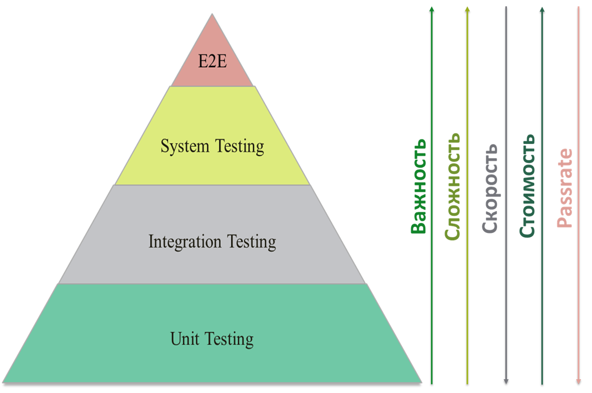

# **Теория тестирования**

## **Что такое тестирование ПО (Software Testing)?**
*Тестирование ПО (Software Testing)* - проверка соответствия между реальным и ожидаемым поведением программы, осуществляемая на конечном наборе тестов, выбранном определенным образом. В более широком смысле, тестирование — это одна из техник контроля качества, включающая в себя активности по планированию работ (Test Management), проектированию тестов (Test Design), выполнению тестирования (Test Execution) и анализу полученных результатов (Test Analysis).

## **Что такое качество программного обеспечения (Software Quality)?**
*Качество программного обеспечения* — это совокупность характеристик программного обеспечения, относящихся к его способности удовлетворять установленные и предполагаемые потребности. [Quality management and quality assurance]

## **Какие характеристики качества вы знаете?**

## **Обеспечение качества (QA — Quality Assurance) и контроль качества (QC — Quality Control)**
QA и QC эти термины похожи на взаимозаменяемые, но разница между обеспечением качества и контролем качества все-таки есть, хоть на практике процессы и имеют некоторую схожесть.

*QC (Quality Control)* — Контроль качества продукта — анализ результатов тестирования и качества новых версий выпускаемого продукта.
К задачам контроля качества относятся:
* проверка готовности ПО к релизу;
* проверка соответствия требований и качества данного проекта.

*QA (Quality Assurance)* — Обеспечение качества продукта — изучение возможностей по изменению и улучшению процесса разработки, улучшению коммуникаций в команде, где тестирование является только одним из аспектов обеспечения качества.
К задачам обеспечения качества относятся:
* проверка технических характеристик и требований к ПО;
* оценка рисков;
* планирование задач для улучшения качества продукции;
* подготовка документации, тестового окружения и данных;
* тестирование;
* анализ результатов тестирования, а также составление отчетов и других документов

## **Что такое верификация (verification)?**
*Верификация (verification)* — это процесс оценки системы или её компонентов с целью определения удовлетворяют ли результаты текущего этапа разработки условиям, сформированным в начале этого этапа[IEEE]. Т.е. выполняются ли наши цели, сроки, задачи по разработке проекта, определенные в начале текущей фазы.

## **Что такое валидация (validation)?**
*Валидация (validation)* — это определение соответствия разрабатываемого ПО ожиданиям и потребностям пользователя, требованиям к системе [BS7925-1].
Также можно встретить иную интерпритацию:
Процесс оценки соответствия продукта явным требованиям (спецификациям) и есть верификация (verification), в то же время оценка соответствия продукта ожиданиям и требованиям пользователей — есть валидация (validation). Также часто можно встретить следующее определение этих понятий:
Validation — ’is this the right specification?’.
Verification — ’is the system correct to specification?’.

## **Что такое пирамида тестирования?**
*Пирамида тестирования* — один из способов обеспечения качества ПО, визуализация, которая помогает группировать тесты по типу их назначения. Так же, позволяет согласовать правила написания тестов, разделения их на типы, обозначить основной фокус тестирования в каждой из групп.

Уровни тестирования:
Unit/component/program/module testing - тестируется минимально-атомарный модуль программы, чаще всего это одна функция или метод. Таких тестов должно быть больше всего;
Integration testing - несколько модулей программы тестируются вместе;
System testing - вся программа тестируется полностью;
Acceptance testing - программа принимается заказчиком на соответствие заявленным требованиям либо тестировщики проходят end-to-end сценарии с точки зрения пользователя;

## **Зачем тестировать ПО**
*Цели тестирования*:
* Повысить вероятность того, что приложение, будет работать правильно при любых обстоятельствах.
* Повысить вероятность того, что приложение, будет соответствовать всем описанным требованиям.
* Предоставление актуальной информации о состоянии продукта на данный момент.

## **Назовите этапы тестирования**
*Этапы*:
1. Анализ продукта
2. Работа с требованиями
3. Разработка стратегии тестирования
и планирование процедур контроля качества
4. Создание тестовой документации
5. Тестирование прототипа
6. Основное тестирование
7. Стабилизация
8. Эксплуатация

## **Какие виды тестирования вы знаете?**

## **Назовите основные типы/виды тестирования**
*По целям*:
* Функциональное
  * Функциональное
  * Безопастности
  * Взаимодействия
* Нефункциональное
  * UI
  * Совместимости
  * Производительности
    * Нагрузочное
    * Стабильности
    * Стресс
    * Обьемное

*По знанию системы*:
* Белый ящик
* Серый ящик
* Чёрный ящик

*По хронологии выполнения*:
* Входное (Smoke/intake)
* Повторное
* Регрессионное

*По степени автомтизации*
  * Ручное
  * Автоматизированное

*По исполнению кода*
  * Статическое
  * Динамическое

## **Какие виды функционального тестирования вы знаете?**
*Функциональные виды тестирования*
* Функциональное тестирование (Functional testing) - проверить основные функции ПО.
* Тестирование пользовательского интерфейса (GUI Testing)
* Тестирование безопасности (Security and Access Control Testing) - Аутентификация - проверка прав доступа по логин/паролю. Авторизация - проверка логин/пароля. Идентификация - проверка личности. Протестировать двухфакторную аутентификацию. Протестировать подтверждения входа с cuptcha.
* Тестирование взаимодействия (Interoperability Testing) - Проверить кроссбраузерность

## **Какие виды нефункционального тестирования вы знаете?**
*Нефункциональные виды тестирования*
* Все виды тестирования производительности: - Проверка скорости отклика от сервера - как быстро загружаются данные
  * нагрузочное тестирование (Performance and Load Testing) - нагрузка в пределах 80-90% от максимальной нагрузки. Проверка того, как система работате под растущей нагрузкой.
  * стрессовое тестирование (Stress Testing) - нагрузка в пределах 95-110%. Проверка поведения приложения при сверхдопустимых нагрузках.
  * тестирование стабильности или надежности (Stability / Reliability Testing) - нагрузка в пределах 40-60%. Проверка работы приложения на протяжении определенного проежутка времени и оценка количества неработающего времени. Проверка в течение года сколько часов приложени не было доступным.
  * объемное тестирование (Volume Testing) - Проверка на количество хранимой информации в базе данных. Проверка емкости флешки.
* Тестирование установки (Installation testing)
* Тестирование удобства пользования (Usability Testing)
* Тестирование на отказ и восстановление (Failover and Recovery Testing)
* Конфигурационное тестирование (Configuration Testing)"
* Тестирование безопасности - Проверить маскировку данных в поле пароль. Проверить не отображение данных по картам при переводе с карты на карту.

## **Какие связанные с изменениями виды тестирования вы знаете?**
* Дымовое тестирование (Smoke Testing)
* Регрессионное тестирование (Regression Testing)
* Повторное тестирование (Re-testing)
* Тестирование сборки (Build Verification Test)
* Санитарное тестирование или проверка согласованности/исправности (Sanity Testing)

## **Что такое функциональное тестирование?**
*Функциональное тестирование* рассматривает заранее указанное поведение и основывается на анализе спецификаций функциональности компонента или системы в целом.

## **Что такое тестирование пользовательского интерфейса (GUI Testing)?**
*Тестирование пользовательского интерфейса (GUI Testing)* — функциональная проверка интерфейса на соответствие требованиям — размер, шрифт, цвет, consistent behavior.

## **Что такое тестирование безопасности?**
*Тестирование безопасности* — это стратегия тестирования, используемая для проверки безопасности системы, а также для анализа рисков, связанных с обеспечением целостного подхода к защите приложения, атак хакеров, вирусов, несанкционированного доступа к конфиденциальным данным.

## **Performance Testing**
*Тестирование производительности (performance testing)* - определение степени, с которой система выполняет заложенные в нее функции в установленных рамках на время обработки и пропускную способность. Достаточно часто при тестировании производительности проверяется сразу несколько его подвидов.

## **Что такое тестирование на основе рисков?**
*Тестирование на основе рисков/Риск-тестирование (risk-based testing)* — метод тестирования ПО, который базируется на вероятности рисков. Их вероятность определяется путем анализа, в котором учитываются сложность программы, критичность функции для бизнеса, частота ее использования и количество возможных дефектов. При тестировании на основе рисков наибольший приоритет получает проверка самых важных и потенциально имеющих недостатки функций.

## **Что такое тестирование взаимодействия (Interoperability Testing)?**
*Тестирование взаимодействия (Interoperability Testing)* — это функциональное тестирование, проверяющее способность приложения взаимодействовать с одним и более компонентами или системами и включающее в себя тестирование совместимости (compatibility testing) и интеграционное тестирование.

## **Что такое нагрузочное тестирование?**
*Нагрузочное тестирование* — это автоматизированное тестирование, имитирующее работу определенного количества бизнес пользователей на каком-либо общем (разделяемом ими) ресурсе.

## **Что такое стрессовое тестирование (Stress Testing)?**
*Стрессовое тестирование (Stress Testing)* позволяет проверить насколько приложение и система в целом работоспособны в условиях стресса и также оценить способность системы к регенерации, т.е. к возвращению к нормальному состоянию после прекращения воздействия стресса. Стрессом в данном контексте может быть повышение интенсивности выполнения операций до очень высоких значений или аварийное изменение конфигурации сервера. Также одной из задач при стрессовом тестировании может быть оценка деградации производительности, таким образом цели стрессового тестирования могут пересекаться с целями тестирования производительности.

## **Что такое объемное тестирование (Volume Testing)?**
*Объемное тестирование (Volume Testing)*. Задачей объемного тестирования является получение оценки производительности при увеличении объемов данных в базе данных приложения

## **Что такое тестирование стабильности или надежности (Stability / Reliability Testing)?**
*Тестирование стабильности или надежности (Stability / Reliability Testing)*. Задачей тестирования стабильности (надежности) является проверка работоспособности приложения при длительном (многочасовом) тестировании со средним уровнем нагрузки.

## **Что такое тестирование установки?**
*Тестирование установки* направленно на проверку успешной инсталляции и настройки, а также обновления или удаления программного обеспечения.

## **Что такое тестирование удобства пользования?**
*Тестирование удобства пользования* — это метод тестирования, направленный на установление степени удобства использования, обучаемости, понятности и привлекательности для пользователей разрабатываемого продукта в контексте заданных условий. Сюда также входит:
*User eXperience (UX)* — ощущение, испытываемое пользователем во время использования цифрового продукта, в то время как User interface — это инструмент, позволяющий осуществлять интеракцию «пользователь — веб-ресурс».

## **Что такое тестирование на отказ и восстановление (Failover and Recovery Testing)?**
*Тестирование на отказ и восстановление (Failover and Recovery Testing)* проверяет тестируемый продукт с точки зрения способности противостоять и успешно восстанавливаться после возможных сбоев, возникших в связи с ошибками программного обеспечения, отказами оборудования или проблемами связи (например, отказ сети). Целью данного вида тестирования является проверка систем восстановления (или дублирующих основной функционал систем), которые, в случае возникновения сбоев, обеспечат сохранность и целостность данных тестируемого продукта.

## **Что такое конфигурационное тестирование (Configuration Testing)?**
*Конфигурационное тестирование (Configuration Testing)* — специальный вид тестирования, направленный на проверку работы программного обеспечения при различных конфигурациях системы (заявленных платформах, поддерживаемых драйверах, при различных конфигурациях компьютеров и т.д.).

## **Что такое дымовое (Smoke) тестирование?**
*Дымовое (Smoke)* тестирование рассматривается как короткий цикл тестов, выполняемый для подтверждения того, что после сборки кода (нового или исправленного) устанавливаемое приложение, стартует и выполняет основные функции.

## **Что такое регрессионное тестирование?**
*Регрессионное тестирование* — это вид тестирования направленный на проверку изменений, сделанных в приложении или окружающей среде (починка дефекта, слияние кода, миграция на другую операционную систему, базу данных, веб сервер или сервер приложения), для подтверждения того факта, что существующая ранее функциональность работает как и прежде. Регрессионными могут быть как функциональные, так и нефункциональные тесты.

## **Что такое повторное тестирование?**
*Повторное тестирование* — тестирование, во время которого исполняются тестовые сценарии, выявившие ошибки во время последнего запуска, для подтверждения успешности исправления этих ошибок.

*В чем разница между regression testing и re-testing?*
Re-testing — проверяется исправление багов
Regression testing — проверяется то, что исправление багов, а также любые изменения в коде приложения, не повлияли на другие модули ПО и не вызвало новых багов.

## **Какая по вашему мнению частота регрессионного тестирования?**
Стоит делать по возможности и в зависимости от частоты вмешательства в релизы.

## **Что такое тестирование сборки или Build Verification Test?**
*Тестирование сборки или Build Verification Test* — тестирование направленное на определение соответствия, выпущенной версии, критериям качества для начала тестирования. По своим целям является аналогом Дымового Тестирования, направленного на приемку новой версии в дальнейшее тестирование или эксплуатацию. Вглубь оно может проникать дальше, в зависимости от требований к качеству выпущенной версии.

## **Что такое санитарное (Sanity) тестирование?**
*Санитарное тестирование* — это узконаправленное тестирование достаточное для доказательства того, что конкретная функция работает согласно заявленным в спецификации требованиям. Является подмножеством регрессионного тестирования. Используется для определения работоспособности определенной части приложения после изменений произведенных в ней или окружающей среде. Обычно выполняется вручную.

## **Smoke и Sanity тестирование и какая между ними разница**
*Санитарное тестирование или проверка согласованности/исправности (sanity testing)* - узконаправленное тестирование достаточное для доказательства того, что конкретная функция работает согласно заявленным в спецификации требованиям. Является подмножеством регрессионного тестирования. Используется для определения работоспособности определенной части приложения после изменений произведенных в ней или окружении. Обычно выполняется вручную.

*Дымовое/входное тестировние (smoke/intake test)* - специальный тест (короткий цикл тестов) для принятия решения, готов ли компонент или система для дальнейшего детального тестирования. Выполняется для подтверждения того, что после сборки кода (нового или исправленного) приложение, стартует и выполняет основные функции.

## **Какие виды/подходы к интеграционному тестированию Вы знаете?**
*Снизу вверх (Bottom Up Integration)*. Все низкоуровневые модули, процедуры или функции собираются воедино и затем тестируются. После чего собирается следующий уровень модулей для проведения интеграционного тестирования. Данный подход считается полезным, если все или практически все модули, разрабатываемого уровня, готовы. Также данный подход помогает определить по результатам тестирования уровень готовности приложения.

*Сверху вниз (Top Down Integration)*. Вначале тестируются все высокоуровневые модули, и постепенно один за другим добавляются низкоуровневые. Все модули более низкого уровня симулируются заглушками с аналогичной функциональностью, затем по мере готовности они заменяются реальными активными компонентами. Таким образом мы проводим тестирование сверху вниз.

*Большой взрыв («Big Bang» Integration)*. Все или практически все разработанные модули собираются вместе в виде законченной системы или ее основной части, и затем проводится интеграционное тестирование. Такой подход очень хорош для сохранения времени. Однако если тест кейсы и их результаты записаны не верно, то сам процесс интеграции сильно осложнится, что станет преградой для команды тестирования при достижении основной цели интеграционного тестирования.

## **Что такое исследовательское тестирование (exploratory testing)?**
Исследовательское тестирование (exploratory testing) - неформальный метод, при котором тестировщик активно контролирует проектирование тестов, в то время как эти тесты выполняются, и использует полученную информацию для проектирования новых улучшенных тестов. Такое тестирование определяется как одновременное обучение, проектирование теста и его исполнение.

## **Обьясните Black/Grey/White Box Testing**
*Тестирование белого ящика (white box testing)* - тестирование, основанное на анализе внутренней структуры компонента или системы и на знании исходного кода, к которому тестировщик (как правило, это программист) имеет полный доступ.

*Тестирование серого ящика (gray box testing)* - тестирование, ориентированное на имитацию работы пользователей, в условиях, когда часть внутренней структуры программы известна.

*Тестирование чёрного ящика (black box testing)* - тестирование, основанное на анализе функциональной или нефункциональной спецификации системы, при котором программа рассматривается как объект, внутренняя структура которого неизвестна.

## **Что такое операционное тестирование (Release Testing)?**
*Операционное тестирование (Release Testing).*
Даже если система удовлетворяет всем требованиям, важно убедиться в том, что она удовлетворяет нуждам пользователя и выполняет свою роль в среде своей эксплуатации, как это было определено в бизнес моделе системы. Следует учесть, что и бизнес модель может содержать ошибки. Поэтому так важно провести операционное тестирование как финальный шаг валидации. Кроме этого, тестирование в среде эксплуатации позволяет выявить и нефункциональные проблемы, такие как: конфликт с другими системами, смежными в области бизнеса или в программных и электронных окружениях; недостаточная производительность системы в среде эксплуатации и др. Очевидно, что нахождение подобных вещей на стадии внедрения — критичная и дорогостоящая проблема. Поэтому так важно проведение не только верификации, но и валидации, с самых ранних этапов разработки ПО.

## **Что такое приемочное тестирование (Acceptance Testing)?**
*Приемочное тестирование (Acceptance Testing)*
Формальный процесс тестирования, который проверяет соответствие системы требованиям и проводится с целью:
* определения удовлетворяет ли система приемочным критериям;
* вынесения решения заказчиком или другим уполномоченным лицом принимается приложение или нет.

## **Что такое End-to-End тест?(сквозное тестирование)**
End-to-End тесты - такие интеграционные тесты, которые воздействуют на систему через ее самые внешние интерфейсы и проверяют ожидаемую реакцию системы через эти же интерфейсы.
Почему именно интеграционные? Потому, что это единственное, что можно о них сказать наверняка: они по определению не могут быть модульными тестами. А все остальное: являются ли они одновременно приемочными, нагрузочными или еще какими - зависит только от общих плана/стратегии тестирования и той роли, которые эти тесты в них играют.

## **Уровни тестирования / Классификация по уровню детализации приложения**
* *Модульное/Компонентное* (unit/component testing)* - тестирование наименьших элементов ПО, которые могут быть протестированы по-отдельности (модули, объекты, классы, функции).  
Задача модульного тестирования - выявление локализованных в модуле ошибок реализации алгоритмов, а также определение степени готовности системы к переходу на следующий уровень разработки и тестирования. Проводится самими разработчиками, так как предполагает полный доступ к коду.

* *Интеграционное (integration testing)* - тестирование части системы, состоящей из двух и более модулей.  
Задача интеграционного тестирования - поиск дефектов, связанных с ошибками реализации и интерпретации интерфейсного взаимодействия между модулями, а также ошибок взаимодействия с другими частями системы (ОС, оборудованием).

* *Системное (system testing)* - процесс тестирования системы, на котором проводится не только функциональное тестирование, но и оценка характеристик качества системы — ее устойчивости, надежности, безопасности и производительности.
Задача системного тестирования - выявление дефектов, связанных с общей работой системы, таких как неверное использование ресурсов системы, непредусмотренные комбинации данных пользовательского уровня, несовместимость с окружением, непредусмотренные сценарии использования, отсутствующая или неверная функциональность, неудобство в применении и т.д.

* *Приёмочное (acceptance testing)* - формальный процесс тестирования, который проверяет соответствие системы потребностям, требованиям и бизнес процессам пользователя, и проводится для вынесения решения заказчиком (внутренним или внешним) или другим уполномоченным лицом принимается приложение или нет.

## **Какая разница между Альфа и Бета-тестированием?**
*Альфа-тестирование* — является ранней версией программного продукта, тестирование которой проводится внутри организации-разработчика; может быть вероятно частичное привлечение конечных пользователей.

*Бета-тестирование* — практически готовое ПО, выпускаемое для ограниченного количества пользователей, разрабатывается в первую очередь для тестирования конечными пользователями и получения отзывов клиентов о продукте для внесения соответствующих изменений.

## **В чем разница между исследовательским / ad-hoc тестированием?**
Простейшее определение *исследовательского тестирования* — это разработка и выполнения тестов в одно и то же время. Что является противоположностью сценарного подхода (с его предопределенными процедурами тестирования, неважно ручными или автоматизированными). Исследовательские тесты, в отличие от сценарных тестов, не определены заранее и не выполняются в точном соответствии с планом.

*ad-hoc тестирование* - Тестирование приложения без понимания принципов тестирования: как мама/бабушка тестировли бы.

Разница между ad hoc и exploratory testing в том, что теоретически, ad hoc может провести кто угодно, а для проведения exploratory необходимо мастерство и владение определенными техниками. Обратите внимание, что определенные техники это не только техники тестирования.

## **Чем отличается статическое тестирование от динамического?**
Статическое тестирование отличается от динамического тем, что производится без запуска программного кода продукта. Тестирование осуществляется путем анализа программного кода (code review) или скомпилированного кода. Анализ может производиться как вручную, так и с помощью специальных инструментальных средств. Целью анализа является раннее выявление ошибок и потенциальных проблем в продукте. Также к статическому тестированию относится тестирования спецификации и прочей документации.

## **Назовите принципы тестирования**
*Принципы тестирования*
*Принцип 1 — Тестирование демонстрирует наличие дефектов (Testing shows presence of defects)*
Тестирование может показать, что дефекты присутствуют, но не может доказать, что их нет. Тестирование снижает вероятность наличия дефектов, находящихся в программном обеспечении, но, даже если дефекты не были обнаружены, это не доказывает его корректности.

*Принцип 2 — Исчерпывающее тестирование недостижимо (Exhaustive testing is impossible)*
Полное тестирование с использованием всех комбинаций вводов и предусловий физически невыполнимо, за исключением тривиальных случаев. Вместо исчерпывающего тестирования должны использоваться анализ рисков и расстановка приоритетов, чтобы более точно сфокусировать усилия по тестированию.

*Принцип 3 — Раннее тестирование (Early testing)*
Чтобы найти дефекты как можно раньше, активности по тестированию должны быть начаты как можно раньше в жизненном цикле разработки программного обеспечения или системы, и должны быть сфокусированы на определенных целях.

*Принцип 4 — Скопление дефектов (Defects clustering)*
Усилия тестирования должны быть сосредоточены пропорционально ожидаемой, а позже реальной плотности дефектов по модулям. Как правило, большая часть дефектов, обнаруженных при тестировании или повлекших за собой основное количество сбоев системы, содержится в небольшом количестве модулей.

Принцип Парето 20/80 - Из общего количества возможных тестов всегда необходимо выбирать 20% таких, которые найдут 80% всех багов

*Принцип 5 — Парадокс пестицида (Pesticide paradox)*
Если одни и те же тесты будут прогоняться много раз, в конечном счете этот набор тестовых сценариев больше не будет находить новых дефектов. Чтобы преодолеть этот «парадокс пестицида», тестовые сценарии должны регулярно рецензироваться и корректироваться, новые тесты должны быть разносторонними, чтобы охватить все компоненты программного обеспечения,
или системы, и найти как можно больше дефектов.

*Принцип 6 — Тестирование зависит от контекста (Testing is contex depending)*
Тестирование выполняется по-разному в зависимости от контекста. Например, программное обеспечение, в котором критически важна безопасность, тестируется иначе, чем сайт электронной коммерции.

*Принцип 7 — Заблуждение об отсутствии ошибок (Absence-of-errors fallacy)*
Обнаружение и исправление дефектов не помогут, если созданная система не подходит пользователю и не удовлетворяет его ожиданиям и потребностям.